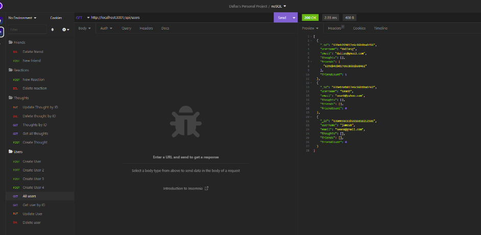
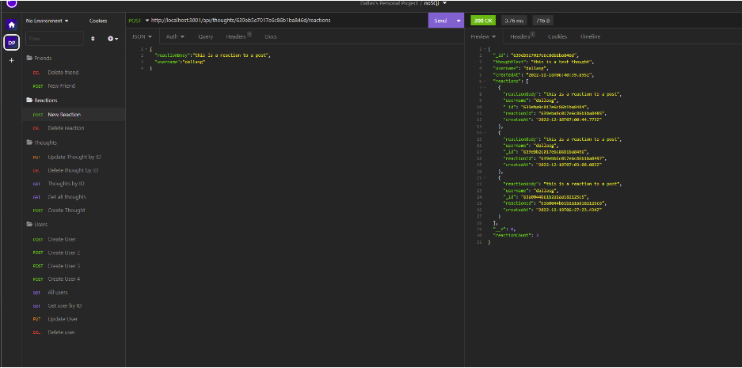
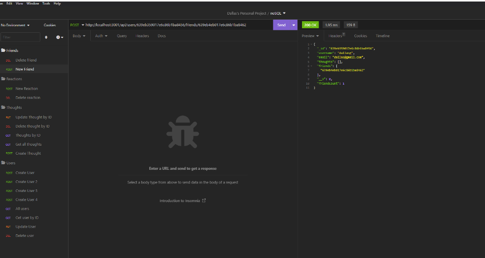

# SocialNetwork

Module 18 Social Network

# ABOUT

This project is a social media API that allows a user to create a friend network, add comments and reactions to comments.

The applications shows responses to get requests such as the following:

The application sends sends updated fields as a response to PUT or POST requests.

# INSTALLATION

npm i

Then

npm start

# LICENSE

The MIT License text can be found at https://opensource.org/licenses/MIT or within the <a href="./LICENSE">MIT License</a> file.
